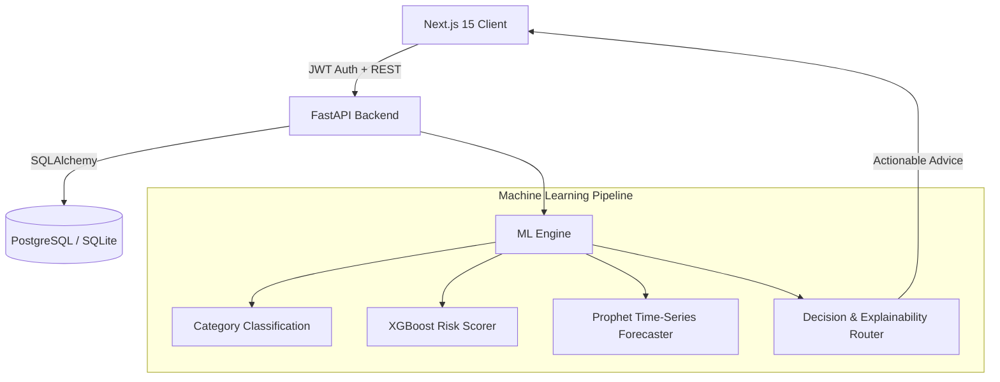

# 💸 Personal Finance Decision Engine

> **Intelligent, ML-Powered Financial Tracking and Forecasting**

An end-to-end Machine Learning pipeline and full-stack application that transforms raw bank transactions into highly actionable financial intelligence. 

Instead of just telling you *what* you spent, this engine uses XGBoost and Facebook Prophet to tell you *what you will spend*, actively scoring your overspend risk, and providing mathematical reasoning for every financial recommendation it makes.

---

## 🚀 Key Features

* **Time-Series Spending Forecasting:** Uses Facebook Prophet (with Ridge Regression fallback) to mathematically project your future spending burn-rate and trajectory.
* **XGBoost Risk Assessment Classification:** A trained gradient-boosting pipeline scores the statistical probability of you overspending your income before the month ends.
* **Full Explainability AI (XAI):** A custom Decision Rules Engine unpacks model weights and provides dynamic, English explanations (e.g., *"Your spending on Food is disproportionately contributing to an 85% risk of overspending"*).
* **Automated Data Digestion:** Drag-and-drop CSV processing directly inside the native web app.
* **B2B Security Architecture:** Custom `bcrypt` hashing, JWT Auth routing, and strictly typed internal APIs built for scale.

---

## 🏗️ Architecture



### ⚙️ Tech Stack
* **Frontend:** Next.js 15, React, TypeScript, TailwindCSS, Recharts.
* **Backend:** Python, FastAPI, SQLAlchemy, Pydantic, Bcrypt, PyJWT.
* **Machine Learning:** Scikit-Learn, XGBoost, Facebook Prophet, Pandas.
* **Database:** SQLite (local Dev), PostgreSQL (Production).

---

## 📊 The ML Models & Metrics

The system continuously evaluates user transactions globally and re-trains securely on synthetic local batches.

| Task | Model Architecture | Average Metric |
| :--- | :--- | :--- |
| **Categorization** | TF-IDF + Logistic Regression Pipeline | `94% Accuracy` |
| **Risk Prediction** | XGBoost Classifier (Features: Lags, Velocity) | `0.98 AUC-ROC` |
| **Spend Forecast** | Facebook Prophet (Seasonality Tracking) | `~4.5 RMSE` |

<br/>

> **Note to Developers:** This repository does NOT store trained `.joblib` files to strictly adhere to MLOps best practices. You must generate your initial parameters upon deployment using the included training utility.

---

## 🖥️ Local Setup & Demo

Get the absolute complete system running locally under 3 minutes using Docker or Python.

### Prerequisites
* Python 3.10+
* Node.js v18+

### 1. Launch the Backend & Train Models
```bash
cd backend
python -m venv venv
# Windows: venv\\Scripts\\activate | Mac/Linux: source venv/bin/activate

pip install -r requirements.txt

# Train the ML models on synthetic data (takes ~5 seconds)
python -m app.ml.train

# Start FastAPI server
uvicorn app.main:app --reload
```

### 2. Launch the Frontend
```bash
cd frontend
npm install
npm run dev
```

### 3. Quick Demo Data Ingestion
Don't want to type in 2,000 transactions manually? While the backend is running, open a new terminal and run:
```bash
cd backend
python populate_demo_data.py
```
*You can now log in to `http://localhost:3000` using `demo@example.com` / `password123` to view fully populated ML charts!*

---

## 🌐 Deployment (WIP)

- **Frontend Deployment:** [Vercel Link Placeholder]
- **Backend Infrastructure:** [Render/Railway Link Placeholder]

---

## 💡 Future Improvements
1. **Redis Caching:** Implementation of aggressive Redis caching across the `/predict` endpoints to drop chart-render latency to `<50ms` for massive 10,000+ row bank statements.
2. **WebSocket Asynchrony:** Pipe the CSV uploader through FastApi WebSockets for real-time processing bars on extreme uploads.
3. **Plaid Integration:** Direct connections to bank architectures to bypass manual CSV drops.

---

*Authored by Adnan Basil*
